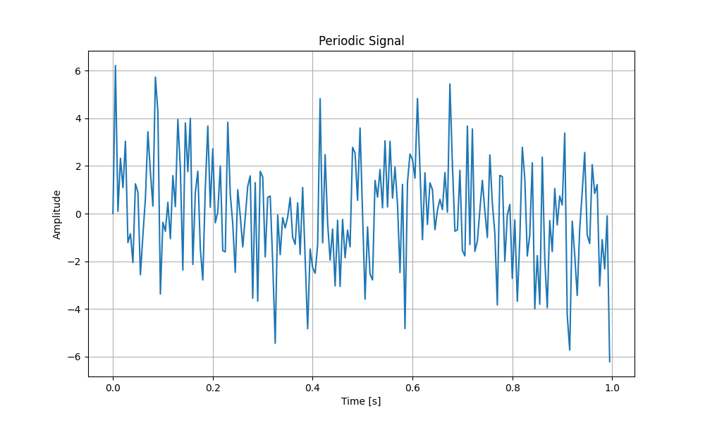
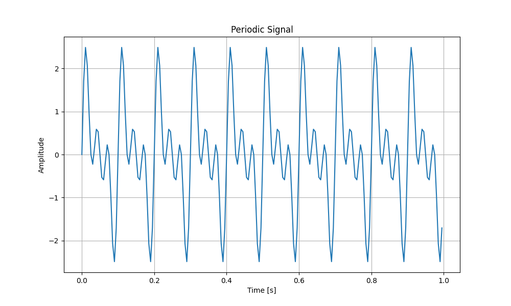
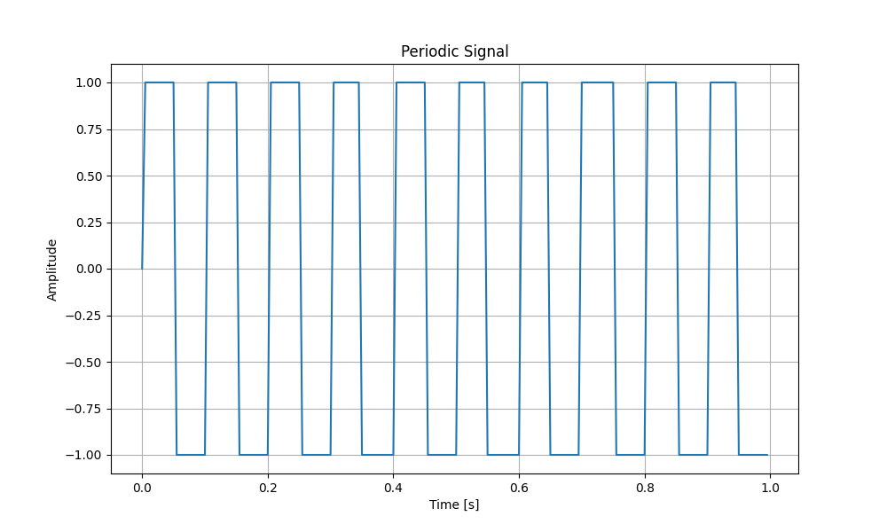
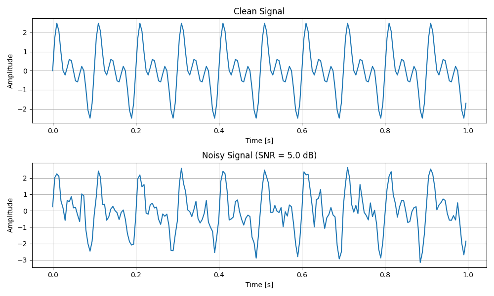
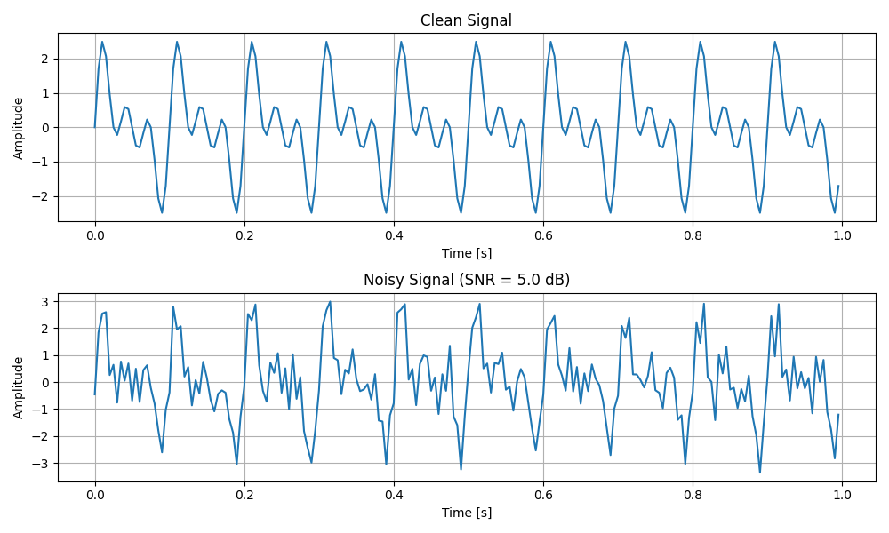
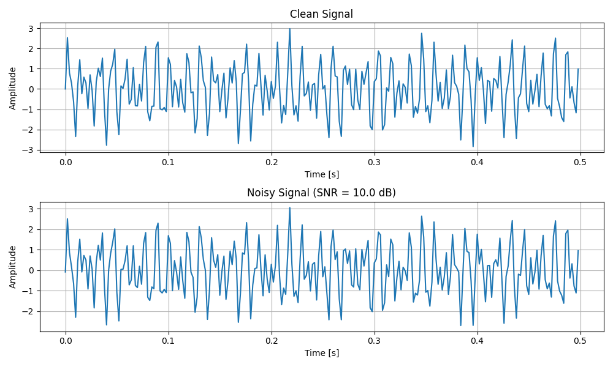

## Table of Contents
1. [Signal-noise Simulator](#signal-noise-simulator)
2. [Installation](#installation)
3. [Dependencies](#dependencies)
4. [Repository Structure](#repository-structure)
5. [Documentation](#documentation)
6. [Scripts overview](#scripts-overview)
7. [Usage](#usage)

# Signal-noise Simulator

This repository contains a Python-based toolkit for generating, manipulating, and analyzing periodic signals. It provides a set of scripts that allow users to create signals with sinusoidal or square components, add controlled noise (both white and colored), and perform spectral transformations. The repository includes core functions for signal generation, noise addition, and visualization, along with utilities for saving the results to CSV files. The project also features unit tests to ensure the stability and correctness of the code. It is designed to support basic signal processing tasks, including signal generation and noise simulation.

## Installation

To use this repository, first clone it with:

```bash
git clone https://github.com/malvasochiara/signal-noise-simulator.git
cd signal-noise-simulator
```

## Dependencies

This project requires **Python ≥ 3.8** and the following Python packages:

- `numpy==1.23.5`
- `matplotlib==3.10.0`
- `pytest==8.3.4`
- `pytest-cov==6.0.0`

You can install them using:

```bash
python -m pip install -r requirements.txt
```

## Repository Structure

This repository contains the following folders and files:

-  [`docs`](docs/) : Contains the documentation for the project, generated using Sphinx.
-  [`generated_results`](generated_results/) : Contains example `.csv` files and plot images generated by the scripts, showcasing both clean and noisy signals.
-  [`config_example`](config_example/) : Contains example configuration `.ini` files to be used from command line as inputs  for `signal_builder.py`.
- [`signal_toolkit.py`](signal_toolkit.py): Core functions for signal generation, noise addition, and spectral transformations.
- [`test_signal_toolkit.py`](test_signal_toolkit.py): Unit tests for `signal_toolkit.py`.
- [`utils.py`](utils.py): Utility functions for plotting and saving signals.
- [`signal_builder.py`](signal_builder.py): Main script for generating and saving signals with optional noise.
- [`requirements.txt`](requirements.txt): Contains the list of dependencies required for the project.

## Documentation

The documentation for this project is available on https://malvasochiara.github.io/signal-noise-simulator/.

This site is generated using **Sphinx** from the docstrings in the code. It provides detailed explanations of the functionality of each script in the repository, including descriptions of the core functions and how they interact to generate, analyze, and manipulate periodic signals.

The [`docs`](docs/) folder contains the source files used to generate this documentation. 

## Scripts overview

##### `signal_toolkit.py`
Provides core functions for generating and analyzing signals, including periodic signal creation, noise addition, and spectral transformations. Users can generate signals with sinusoidal or square components, introduce controlled noise (white or colored), and compute key properties like power and frequency content.

⚠️ Some spectral modifications produce complex-valued signals. Ignoring the imaginary part may alter the spectral characteristics, affecting the intended noise profile.

---

##### `test_signal_toolkit.py`
Contains unit tests for all functions in `signal_toolkit.py`, ensuring correctness and stability. The tests follow the unit testing approach and are implemented using pytest.

**Usage:**
To run all tests from the command line, navigate to the script's directory and execute:

```bash
pytest test_signal_toolkit.py
```

This will automatically discover and run all test cases, providing a report on passed and failed tests.

**Test Coverage:**
To check the test coverage and ensure all functions are properly tested, use `pytest-cov`:

```bash
pytest test_signal_toolkit.py --cov=signal_toolkit
```

This command will generate a coverage report, highlighting which parts of `signal_toolkit.py` are tested and which are not.

---

##### `utils.py`
Provides utility functions for plotting and saving signals. It includes tools for visualizing clean and noisy signals, comparing different noise levels, and exporting data to CSV files. These functions are used in `signal_builder.py` to display generated signals and store results for further analysis.

---

##### `signal_builder.py`

Generates periodic signals by combining sinusoidal or square waves with either random or user-defined frequencies. The signal can be customized through command-line arguments, allowing users to control parameters such as duration, sampling rate, and waveform type. The generated signal can be visualized with an optional plot and saved to a CSV file. Noise can be added to the signal by specifying a signal-to-noise ratio (SNR). The script supports two types of noise: *white noise* (Gaussian) and *colored noise*, where the spectral slope can be adjusted to control how noise power increases with frequency. For reproducibility, the user can independently set a seed for frequency generation and a separate seed for noise generation.

The script also supports loading parameters from a configuration file (`config.ini`). Command-line arguments take precedence over configuration file values.

⚠️ When using colored noise, the resulting signal is inherently complex-valued. Ignoring the imaginary part and considering only the real component may alter the spectral characteristics, potentially distorting the expected linear frequency dependence of the noise.

The user can choose to save the generated signal and time data to a CSV file, with the filename automatically reflecting key parameters such as waveform type, sampling rate, noise type, and SNR. The filename also includes a timestamp to ensure uniqueness. The save location can be specified, or the file will be stored in the current directory by default.

⚠️ Warning: Some parameters cannot be used together. For example, manually specified frequencies and the number of signal components exclude each other, and certain noise-related parameters are valid only under specific conditions. Additionally, the spectral slope of the noise (slope) is applicable only to colored noise and cannot be used with white noise. To avoid errors or unexpected behavior, it is recommended to consult the command `--help` or the documentation for further details on allowed combinations.


## Usage  

The script `signal_builder.py` can be run from the command line with different configurations. Below are some common usage examples.  

### 1️⃣ Generate and Plot a Signal  
To generate a signal with randomly chosen frequencies and plot it:  
```bash
python signal_builder.py --duration 1.0 --sampling_rate 200 --num_components 10 --plot
``` 

<p align="center">

</p>

To specify custom frequencies:  
```bash
python signal_builder.py --duration 1.0 --sampling_rate 200 --frequencies 10,20,30 --plot
```  

<p align="center">

</p>

To generate a square wave instead of a sine wave:
```bash
python signal_builder.py --duration 1.0 --sampling_rate 200 --frequencies 10 --waveform_type square --plot
```  

<p align="center">

</p>


### 2️⃣ Add Noise to the Signal  
To generate a signal with custom frequencies and white noise at 10 dB SNR:  
```bash
python signal_builder.py --duration 1.0 --sampling_rate 200 --frequencies 10,20,30 --num_components 10 --snr 5 --plot
```  

<p align="center">

</p>

To generate a signal with custom frequencies and colored noise (spectral slope 0.7):  
```bash
python signal_builder.py --duration 1.0 --sampling_rate 200 --frequencies 10,20,30 --snr 5 --noise_type colored --slope 0.7 --plot
```  

<p align="center">

</p>

### 3️⃣ Save the Generated Signal  
To save the generated signal in the current directory:  
```bash
python signal_builder.py --num_components 5 --duration 1.0 --sampling_rate 250 --save
```  

To specify a custom save directory:  
```bash
python signal_builder.py --num_components 5 --duration 1.0 --sampling_rate 250 --save /path/to/directory
```  

When using the `--save` option, the generated signal is saved as a `.csv` file with a descriptive name that includes a timestamp to prevent overwriting.
You can find example saved signals (both clean and with noise) in the [`generated_results`](generated_results/) folder.

### 4️⃣ Use a Configuration File
To load parameters from a configuration file (config.ini):

```bash
python signal_builder.py --config config1.ini --plot
```

<p align="center">

</p>

The file used to generate this plot is available in in the [`generated_results`](generated_results/) folder, as well as other example of configuration file, while the corresponding configuration files can be found the  [`config_example`](config_example/) folder

### ℹ️ Accessing Help  
For a complete list of parameters and their descriptions, run:  
```bash
python signal_builder.py --help
```
